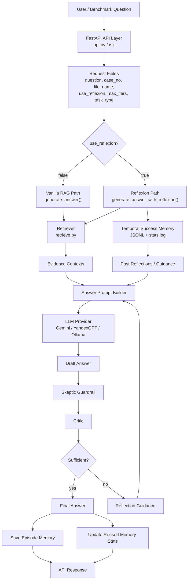
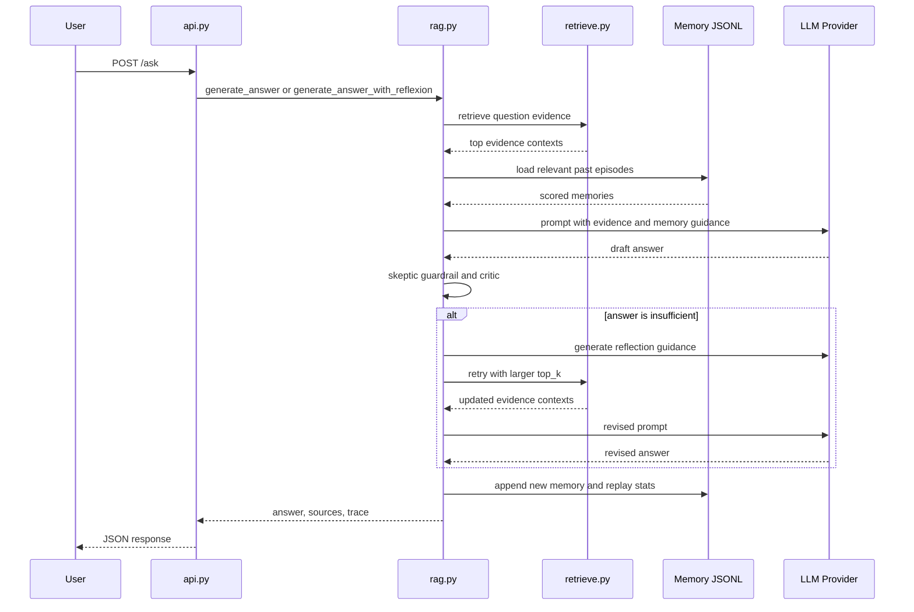

# Reflexion Temporal Memory Success Agent RAG Architecture

This document explains the architecture of `ReflexionTemporalMemorySuccessAgentRAG` in detail. The project is a Retrieval-Augmented Generation system with a Reflexion loop and a temporal success-based episodic memory controller.

The short version is:

1. Retrieve evidence.
2. Generate an answer from evidence.
3. Check whether the answer is grounded.
4. If weak, reflect and retry.
5. Save the episode as memory.
6. Reuse only memories that are recent, relevant, successful, and low-risk.

## High-Level Architecture



## Main Runtime Flow



## 1. API Layer

The API layer is implemented in `api.py`.

The endpoint is:

```text
POST /ask
```

The request model contains:

```text
question       The user question or benchmark prompt.
case_no        Optional metadata filter for legal cases.
file_name      Optional metadata filter for source documents.
use_reflexion  Whether to use the Reflexion loop.
max_iters      Maximum number of answer-reflect-retry attempts.
task_type      Task mode, such as qa_generation, grounded_qa, extractive_qa, hallucination_detection.
```

If `use_reflexion` is false, `api.py` calls:

```python
generate_answer(...)
```

If `use_reflexion` is true, it calls:

```python
generate_answer_with_reflexion(...)
```

The response contains:

```text
answer             Final answer text.
sources            Retrieved evidence chunks.
reflexion_trace    Only returned when Reflexion is enabled.
embedding          Optional, controlled by RETURN_QUERY_EMBEDDING.
```

## 2. Retrieval Layer

The retrieval layer is implemented in `retrieve.py`.

Its main function is:

```python
retrieve(query, top_k=5, case_no=None, file_name=None, source_file_path=None)
```

The retriever has two modes.

### Local Corpus Mode

If:

```text
LOCAL_CORPUS_ONLY=1
```

then retrieval uses local JSONL chunks. It performs lexical retrieval using token matching and BM25-style scoring.

This is useful for benchmark runs or offline experiments where Pinecone is not needed.

### Pinecone + Hybrid Mode

If `LOCAL_CORPUS_ONLY` is not enabled, the retriever:

1. Creates a query embedding using `yandex_embed.get_embedding`.
2. Searches Pinecone.
3. Applies metadata filters if `case_no` or `file_name` are provided.
4. Retrieves dense semantic candidates.
5. Retrieves local lexical candidates as well.
6. Merges dense and lexical candidates.
7. Reranks the merged set.

The reranking combines:

```text
semantic score
lexical BM25 score
exact phrase bonus
quoted text bonus
case match bonus
file match bonus
document span reranking
local window reranking
optional LLM reranking
```

This is especially useful for legal QA because exact phrases, citations, and document names often matter as much as semantic similarity.

## 3. Benchmark Profile Layer

`rag.py` detects the benchmark or task family using:

```python
_benchmark_family(...)
_benchmark_profile(...)
```

The profile controls behavior such as:

```text
role
requires_citations
prefer_primary_evidence
allow_multi_context
use_memory
save_memory
abstention_success
```

Examples:

```text
ragtruth       strict evidence-grounded QA, usually no citations.
qrecc          conversational QA.
local_legal    legal QA, citations required, primary evidence preferred.
generic        default grounded QA behavior.
```

This layer matters because the same codebase can run different tasks without using the same prompt rules for everything.

## 4. Temporal Success Episodic Memory

This is the central special feature of the project.

Memory is stored in JSONL files. A base memory entry contains the original episode:

```text
question
task_type
case_no
file_name
final answer span
critic issues
skeptic result
reflection text
success_count
failure_count
alpha
beta
hallucination_risk
created_at
last_used_at
```

A separate append-only stats file stores replay outcomes. Instead of rewriting the full memory file, the project appends events like:

```text
memory_id
replay_count_delta
success_count_delta
failure_count_delta
alpha_delta
beta_delta
last_used_at
last_outcome
```

This is a good design because it keeps memory history auditable.

## 5. Memory Scoring

When a new question arrives, the memory controller searches past episodes and scores them.

The score is:

```text
score =
    similarity
  * temporal_weight
  * reliability
  * risk_penalty
  * (1 + metadata_bonus)
```

### Similarity

Similarity is token-overlap Jaccard similarity between the current question and a previous question:

```text
similarity = shared_tokens / all_unique_tokens
```

This prevents unrelated memories from being reused.

### Temporal Weight

Temporal weight makes recent memories stronger:

```text
temporal_weight = exp(-age_days / REFLEXION_TEMPORAL_DECAY_DAYS)
```

If a memory is old and has not been reused recently, it fades.

### Reliability

Reliability is Bayesian-style:

```text
reliability = alpha / (alpha + beta)
```

Successful memories increase `alpha`. Failed memories increase `beta`.

### Risk Penalty

Hallucination-prone memories are downweighted:

```text
risk_penalty = 1 - REFLEXION_HALLUCINATION_PENALTY * hallucination_risk
```

The code also keeps a floor so the penalty does not become completely zero.

### Metadata Bonus

If the memory comes from the same case or same file, it gets a bonus:

```text
same case_no    -> REFLEXION_CASE_MATCH_BONUS
same file_name  -> REFLEXION_FILE_MATCH_BONUS
```

For legal QA, this is important because repeated questions from the same judgment or contract often share answer patterns.

## 6. Memory Filtering

For `grounded_qa`, memory reuse is more conservative.

The system filters memories by:

```text
same task_type
origin_success must be true
success_count must be greater than zero
hallucination_risk must be below the configured limit
same case or same file when grounded mode requires it
memory must contain reflection text
score must pass a minimum threshold
```

This prevents failed or unrelated memories from contaminating grounded answers.

## 7. Prompt Construction

The answer prompt is created by `_answer_prompt`.

It can include:

```text
system role from benchmark profile
relevant past reflections
current iteration guidance
primary evidence
supporting context
question
formatting and citation rules
grounding rules
```

The prompt changes depending on mode:

```text
strict_extractive       Use only the primary evidence and answer with a short span.
constrained_grounding   Use only explicit facts in evidence.
normal grounded QA      Answer concisely with evidence support.
```

For RAGTruth-style benchmarks, constrained grounding is important because the aim is to avoid unsupported information.

## 8. Answer Generation

The model provider is controlled by:

```text
LLM_PROVIDER
```

Supported providers in `rag.py`:

```text
gemini   Uses google.genai.
yandex   Uses Yandex Foundation Models completion API.
ollama   Uses a local Ollama server.
```

The generation temperature is lower for constrained grounding:

```text
temperature = 0.0 for constrained grounded tasks
temperature = 0.2 for general generation
```

This is sensible because grounded QA should be deterministic and conservative.

## 9. Grounding Trim and Skeptic Guardrail

After answer generation, the system verifies support.

For `grounded_qa`, it can trim the answer to a supported core.

Then the skeptic guardrail checks:

```text
supported claims
unsupported claims
counter evidence
false premise risk
verdict: accept, revise, reject
guidance
```

Possible guardrail actions:

```text
accept    Keep answer.
trim      Remove unsupported claims.
abstain   Replace with Insufficient context.
```

This is one of the main hallucination-control mechanisms.

## 10. Critic

The critic decides whether the answer is sufficient.

It considers:

```text
answer content
retrieved context
primary evidence
task type
strict extractive mode
skeptic result
benchmark profile
```

If the answer passes, the Reflexion loop stops early.

If not, the system generates reflection guidance and tries again.

## 11. Reflexion Loop

The Reflexion path is:

```text
attempt answer
run skeptic
run critic
if insufficient, reflect
retry with guidance
save trace
```

Each retry can use:

```text
critic guidance
skeptic guidance
retrieval-level reflection
answer-level reflection
self-reflection
```

The next iteration also increases `top_k`:

```python
top_k + (iteration - 1)
```

So later attempts may see more evidence than the first attempt.

## 12. Episode Reflection

After the final attempt, the system builds an episode-level reflection.

This is a compact lesson from the run, such as:

```text
what failed
what evidence mattered
what to do differently next time
```

That reflection becomes the reusable memory guidance for future similar questions.

## 13. Memory Save

At the end of `generate_answer_with_reflexion`, the system builds a new memory entry.

Important fields include:

```text
memory_id
question
benchmark_name
task_type
case_no
file_name
attempt_count
is_sufficient
origin_success
success_count
failure_count
alpha
beta
hallucination_risk
exact_answer_span
source_chunk_id
final_reflection
last_guidance
issues
skeptic result
multi_level_reflection
```

If the benchmark profile allows saving memory, the entry is appended to the memory JSONL file.

## 14. Replay Outcome Update

If old memories were used in this run, the system updates their statistics.

If the final answer succeeds:

```text
success_count_delta = 1
alpha_delta = 1
last_outcome = success
```

If the final answer fails:

```text
failure_count_delta = 1
beta_delta = 1
last_outcome = failure
```

This means memory trust is learned over time.

## 15. RAGTruth Fixed-Context Benchmark Flow

Your active benchmark file is:

```text
data/ragtruth_fixed_context/ragtruth_fixed_context_benchmark.jsonl
```

Each row contains:

```text
id
question
fixed_context
reference_response
response_has_hallucination
hallucinated_spans
hallucination_types
source_name
task_type
benchmark_type
```

For this benchmark, the system often does not need normal retrieval because the context is already fixed. The evaluator builds one context record from `fixed_context`, then runs the same answer/critic/reflexion machinery.

This benchmark is useful for testing whether the model creates unsupported claims even when evidence is explicitly provided.

## 16. Important Configuration Flags

Common environment controls:

```text
LLM_PROVIDER
GEMINI_MODEL
YANDEX_GPT_MODEL
OLLAMA_MODEL

LOCAL_CORPUS_ONLY
HYBRID_RETRIEVAL_ENABLED
LEXICAL_RERANK_ENABLED

REFLEXION_MEMORY_PATH
REFLEXION_MEMORY_STATS_PATH
REFLEXION_MEMORY_DIR

REFLEXION_TEMPORAL_DECAY_DAYS
REFLEXION_HALLUCINATION_PENALTY
REFLEXION_CASE_MATCH_BONUS
REFLEXION_FILE_MATCH_BONUS
REFLEXION_MIN_MEMORY_SCORE

REFLEXION_GROUNDED_MIN_MEMORY_SCORE
REFLEXION_GROUNDED_MAX_MEMORY_HALLUCINATION_RISK
REFLEXION_GROUNDED_TOP_N

REFLEXION_FAST_MODE
REFLEXION_ENABLE_SELF_REFLECTION
REFLEXION_ENABLE_MULTI_LEVEL_REFLECTION
REFLEXION_ENABLE_EPISODE_REFLECTION
REFLEXION_DISABLE_BENCHMARK_MEMORY
```

One important detail: benchmark memory can be disabled by default with:

```text
REFLEXION_DISABLE_BENCHMARK_MEMORY=1
```

So when reporting results, always state whether benchmark memory was enabled.

## 17. What Makes This Different From Vanilla RAG

Vanilla RAG does this:

```text
question -> retrieve -> prompt -> answer
```

This system does this:

```text
question
-> retrieve evidence
-> retrieve successful memories
-> answer
-> skeptic verification
-> critic evaluation
-> reflection and retry
-> save episode
-> update memory trust
```

The memory system is not just a cache. It is adaptive:

```text
recent memories are stronger
successful memories are stronger
failed memories are weaker
hallucination-prone memories are penalized
same-document memories are preferred
```

## 18. Suggested Thesis / Report Description

The proposed system extends a conventional RAG pipeline with a Reflexion-based feedback loop and a temporal success-aware episodic memory module. The retrieval layer combines dense vector search with lexical reranking to obtain evidence passages. The generation layer constructs benchmark-specific grounded prompts and produces candidate answers using an external or local LLM. A skeptic guardrail and critic then evaluate factual support. If the answer is insufficient, the system generates reflection guidance and retries with expanded evidence. After the episode, successful and failed outcomes are written to an episodic memory store. Future questions retrieve prior reflections using a score that combines question similarity, temporal decay, Bayesian reliability, hallucination-risk suppression, and metadata matching. This allows the system to learn which past reasoning patterns are useful while reducing reuse of memories associated with hallucinated or unsupported answers.

## 19. File Map

```text
api.py
  FastAPI endpoint and request/response wrapper.

rag.py
  Main reasoning engine: answer generation, Reflexion loop, critic, skeptic,
  prompt construction, benchmark profiles, memory scoring, memory updates.

retrieve.py
  Evidence retrieval: Pinecone, local lexical search, hybrid reranking,
  metadata filtering, window/document reranking.

yandex_embed.py
  Query/document embedding support.

pinecone_setup.py
  Pinecone index initialization.

evaluate_ragtruth_fixed_context.py
  Fixed-context benchmark runner for RAGTruth-style data.

build_ragtruth_fixed_context_adapter.py
  Converts raw RAGTruth-like data into the JSONL benchmark format.

data/ragtruth_fixed_context/ragtruth_fixed_context_benchmark.jsonl
  Active fixed-context benchmark file.

*.memory.jsonl
  Base episodic memory entries.

*.memory.stats.jsonl
  Append-only replay outcome updates.
```
