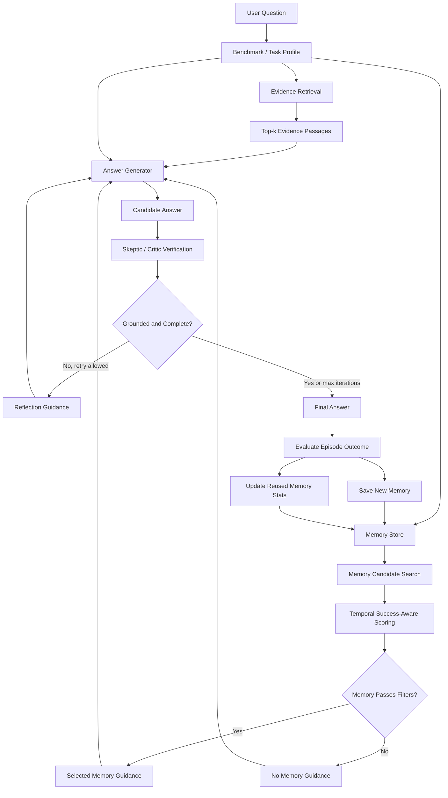

# Chapter 3. Methodology

## 3.1 Research Design

This research follows an experimental systems methodology. The goal is to design, implement, and evaluate a Reflexion-based Retrieval-Augmented Generation system enhanced with temporal success-aware episodic memory. The proposed system is called ReflexionTemporalMemorySuccessAgentRAG. It is designed to improve grounded question answering and reduce hallucination propagation by reusing previous reasoning episodes only when they are relevant, recent, reliable, and low-risk.

The research is motivated by a limitation of standard RAG systems. In a conventional RAG pipeline, the system retrieves evidence and generates an answer in a single pass. This improves factual grounding compared with pure generation, but it does not guarantee that the model will correctly use the retrieved evidence. The model can ignore evidence, overgeneralize from incomplete evidence, or introduce unsupported information. Agentic RAG and Reflexion-style systems improve this process by adding critique and revision, but they often do not systematically learn which previous reasoning patterns were successful and which were harmful.

The proposed methodology extends Reflexion-based RAG with an adaptive episodic memory controller. Each memory stores a previous reasoning episode and its outcome statistics. During inference, the system selects memories using a composite score based on similarity, temporal recency, reliability, hallucination risk, and metadata locality. This allows the system to reuse useful prior reflections while suppressing memories associated with hallucinated or unsupported answers.

## 3.2 Research Goal and Tasks

The goal of this research is to evaluate whether temporal success-aware episodic memory improves the performance of Reflexion-based RAG in grounded question answering.

To achieve this goal, the following tasks are defined:

1. Analyze existing approaches to RAG, Agentic RAG, Reflexion-based reasoning, hallucination reduction, and memory-augmented language agents.
2. Implement a baseline RAG system for grounded question answering.
3. Implement a Reflexion loop that generates, critiques, verifies, and revises answers using retrieved evidence.
4. Develop a temporal success-aware episodic memory mechanism for selecting useful prior reasoning episodes.
5. Compare the proposed system with vanilla RAG, self-refinement, simple Reflexion memory, and temporal Reflexion without memory.
6. Evaluate the systems on conversational QA, hallucination-focused, and source-grounded benchmarks.
7. Analyze whether success-aware memory improves answer quality and reduces detector-estimated hallucination compared with non-memory and simple-memory baselines.

## 3.3 Object and Subject of Research

The object of research is retrieval-augmented generation for question answering with large language models.

The subject of research is temporal success-aware episodic memory inside a Reflexion-based Agentic RAG pipeline. The main focus is memory selection, memory reliability estimation, hallucination-risk suppression, and iterative answer verification.

## 3.4 Proposed Architecture

The proposed architecture consists of four interacting modules:

1. Evidence retrieval module.
2. Answer generation module.
3. Reflexion and verification module.
4. Temporal success-aware episodic memory module.

At inference time, the system receives a question and retrieves relevant evidence passages. If memory is enabled, the memory module searches for prior reasoning episodes that may help answer the current question. The generator then produces a candidate answer using the retrieved evidence and selected memory guidance. The Reflexion module checks the candidate answer for unsupported claims, incomplete reasoning, and possible hallucination. If the answer is judged weak, the system produces reflection guidance and retries generation. After the final answer is produced, the system saves the episode as a new memory and updates the statistics of any reused memories.

The architecture differs from vanilla RAG in two ways. First, generation is iterative rather than single-pass. Second, memory is treated as selective reasoning guidance rather than unconditional context.

## 3.5 Workflow Diagram



## 3.6 Evidence Retrieval Module

The retrieval module provides factual grounding for answer generation. In fixed-context experiments, retrieval is controlled so that each system receives comparable evidence under the same top-k setting. This is important because the purpose of the experiment is to compare reasoning and memory mechanisms rather than unequal retrieval conditions.

The main retrieval parameter is `top_k`, which defines the number of evidence passages passed to the generator. In the main QReCC and RAGTruth comparisons, `top_k = 3` is used. Retrieval quality is measured using a source-hit proxy where gold evidence identifiers are available.

## 3.7 Reflexion and Verification Loop

The Reflexion loop is used to reduce unsupported generation through iterative critique and revision. Each reasoning episode may contain up to three iterations.

Each iteration follows this procedure:

1. Generate a candidate answer from the retrieved evidence and optional memory guidance.
2. Apply a skeptic or critic step to identify unsupported claims, missing evidence, and false-premise risks.
3. Produce reflection guidance if the answer is incomplete or insufficiently grounded.
4. Retry answer generation if another iteration is allowed.
5. Return the final answer when the stopping condition is reached.

This loop is designed to prevent hallucinations from propagating through the reasoning process. Instead of accepting the first generated answer, the system explicitly evaluates whether the answer is supported by the available evidence.

## 3.8 Temporal Success-Aware Episodic Memory

The central contribution of this research is the temporal success-aware episodic memory mechanism. Each memory stores information about a previous reasoning episode, including the original question, reflection text, final outcome, metadata, timestamp, and success/failure statistics.

Each memory entry contains:

```text
memory_id
question
reflection summary
final answer or outcome
benchmark name
task type
file name or case number when available
creation timestamp
last-used timestamp
success count
failure count
alpha
beta
hallucination risk
```

The memory does not act as a simple answer cache. Instead, it stores reusable reasoning guidance. This reduces the risk of directly copying previous answers into new contexts.

## 3.9 Memory Scoring

For each new query, candidate memories are ranked using a composite score:

```text
memory_score =
    similarity
  * temporal_weight
  * reliability
  * risk_penalty
  * (1 + metadata_bonus)
```

The components are:

```text
similarity        = lexical overlap between current and previous question
temporal_weight   = exp(-age_days / decay_days)
reliability       = alpha / (alpha + beta)
risk_penalty      = max(epsilon, 1 - lambda * hallucination_risk)
metadata_bonus    = bonus for matching file or case metadata
```

Similarity estimates whether the previous question is related to the current query. Temporal weight gives higher priority to recent memories. Reliability estimates how often the memory has supported successful answers. Risk penalty suppresses memories associated with hallucination or failure. Metadata bonus is used when the current query and memory belong to the same document, file, or legal case.

## 3.10 Memory Filtering and Update Procedure

After scores are computed, the system filters memories before inserting them into the prompt. A memory can be rejected if its score is too low, if its hallucination risk is too high, if it lacks useful reflection text, or if it is incompatible with the current benchmark profile.

After a reasoning episode ends, the system saves a new memory record if memory saving is enabled. The system also updates the statistics of any reused memories.

If the episode is successful:

```text
alpha = alpha + 1
```

If the episode is unsuccessful:

```text
beta = beta + 1
```

This update procedure allows the system to estimate memory usefulness over time. Memories that repeatedly help the system become more likely to be reused, while memories associated with failure become less likely to be selected.

## 3.11 Benchmark Selection

The evaluation uses three benchmark groups.

QReCC is used as the primary benchmark for memory evaluation. It is a conversational question answering benchmark, so it naturally contains context dependency, repeated reasoning patterns, and reformulation challenges. These properties make it suitable for testing whether previous reasoning episodes can improve future answers.

RAGTruth is used as a hallucination-focused benchmark. It evaluates whether the system can reduce unsupported generation under fixed evidence conditions. In this research, RAGTruth is used as complementary validation rather than the main proof of memory effectiveness.

LegalBench-RAG and local legal QA are used for domain-specific grounded reasoning. They test whether the system can answer source-sensitive questions and whether memory helps in structured, citation-aware domains.

## 3.12 Experimental Conditions and Baselines

The main comparison includes the following systems:

```text
B0: Vanilla RAG
B1: Self-refine / Agentic RAG
B2: Reflexion RAG with simple verbal memory
B3: Temporal Reflexion RAG without active memory
B4: Temporal Reflexion RAG with success-aware memory
```

The most important memory-specific comparison is:

```text
Temporal Reflexion without memory
vs
Temporal Reflexion with success-aware memory
```

This comparison isolates the effect of memory from the effect of Reflexion itself.

For clean memory testing, the preferred QReCC protocol is:

```text
First 50 QReCC examples: build memory
Last 50 QReCC examples: evaluate with and without memory
```

This prevents future test examples from entering memory before evaluation.

## 3.13 Evaluation Metrics

Answer quality is measured using:

```text
Answer F1
Exact match rate
```

Hallucination behavior is measured using:

```text
Detector-estimated hallucination rate
Non-hallucination rate
Unsupported answer rate where available
```

Retrieval quality is measured using:

```text
Retrieval hit rate or source-hit proxy
```

Memory and agent behavior are measured using:

```text
Memory hit count
Selected memory score
Reliability of selected memories
Hallucination risk of selected memories
Number of Reflexion iterations
```

QReCC does not provide gold hallucination labels in the adapted fixed-context setup. Therefore, hallucination values on QReCC are reported as detector-estimated hallucination rates.

## 3.14 Validity Considerations

Several threats to validity are considered.

First, memory leakage can occur if future test examples are stored before evaluation. This is addressed through sequential memory construction.

Second, hallucination detectors and LLM-based critics are imperfect. For this reason, hallucination estimates are reported together with Answer F1, exact match, retrieval proxy metrics, and qualitative analysis.

Third, performance may depend on retrieval quality. To reduce this confound, systems are compared under matched top-k settings and benchmark splits.

Fourth, memory may be more useful in conversational or repeated-task settings than in independent fixed-context examples. Therefore, QReCC is treated as the primary memory benchmark, while RAGTruth is used as complementary hallucination validation.

## 3.15 Chapter Summary

This chapter described the methodology for evaluating ReflexionTemporalMemorySuccessAgentRAG. The proposed system combines retrieval, iterative Reflexion, and temporal success-aware episodic memory. The methodology defines the system architecture, memory scoring function, memory update procedure, benchmarks, baselines, metrics, and evaluation protocol. The central experimental question is whether temporal success-aware memory improves Reflexion-based RAG beyond a no-memory temporal Reflexion baseline.

# Chapter 4. Results and Discussion

## 4.1 Experimental Setup

The experiments compare vanilla RAG, self-refinement, simple Reflexion memory, temporal Reflexion without memory, and the full temporal success-aware memory system. The main configuration uses `top_k = 3` retrieved evidence passages and a maximum of three Reflexion iterations for temporal systems.

The primary evaluation is conducted on QReCC because it is the most appropriate benchmark for testing episodic memory. RAGTruth is used as a hallucination-focused validation benchmark, while legal QA experiments provide domain-specific evidence of applicability.

## 4.2 QReCC Results

The clean QReCC comparison produced the following results:

```text
Method                         Hallucination   Answer F1   Exact Match
Vanilla RAG                    0.58            0.3341      0.00
Self-refine AgentRAG           0.62            0.3236      0.00
Reflexion simple memory        0.26            0.4066      0.00
Temporal no memory             0.28            0.5238      0.02
Temporal success memory        0.18            0.5199      0.00
```

Compared with vanilla RAG, the temporal success-aware memory system reduces detector-estimated hallucination from 0.58 to 0.18. It also improves Answer F1 from 0.3341 to 0.5199. This indicates that the proposed temporal Reflexion architecture improves grounded conversational QA behavior.

Compared with temporal Reflexion without memory, temporal success-aware memory reduces detector-estimated hallucination from 0.28 to 0.18 while maintaining a similar Answer F1. This is the most important result for the memory component because it isolates memory from the general Reflexion architecture.

## 4.3 Memory-Specific Discussion

The QReCC results suggest that memory is useful when the task contains conversational continuity and repeated reasoning patterns. The no-memory temporal Reflexion system already improves answer quality because it uses iterative verification and revision. However, the success-aware memory system further reduces hallucination, which supports the hypothesis that selected prior reflections can help the model avoid unsupported generation.

The result also shows that memory does not necessarily maximize every metric at the same time. Temporal no-memory has a slightly higher Answer F1, while temporal success memory has a lower hallucination rate. This suggests a trade-off between answer completeness and conservative groundedness. In a hallucination-sensitive system, this trade-off is acceptable because reducing unsupported claims is a central goal of the research.

## 4.4 RAGTruth Results

RAGTruth is used to test hallucination behavior under fixed evidence conditions. In the available clean RAGTruth run, the temporal success-aware memory system did not outperform vanilla RAG on generation hallucination rate. This means RAGTruth should not be presented as the main evidence that memory improves performance.

This result is still useful. It shows that memory benefits are task-dependent. RAGTruth examples are more independent and less conversational than QReCC, so they provide fewer natural opportunities for episodic memory reuse. Therefore, RAGTruth is better interpreted as a stress test for hallucination behavior rather than as the primary memory benchmark.

## 4.5 Domain-Specific Legal QA Discussion

LegalBench-RAG and local legal QA are useful for testing whether the system can operate in source-sensitive domains. In such settings, hallucination risk is especially important because answers must remain faithful to the source document. The metadata bonus in the memory score is designed for this type of task, because memories from the same file or case are more likely to be relevant than memories from unrelated documents.

The legal QA setting should be reported as a domain robustness experiment. If legal results are included in the final thesis, they should focus on groundedness, citation behavior, source locality, and examples of correct or incorrect memory transfer.

## 4.6 Ablation Study

To identify which parts of the memory controller contribute to performance, the following ablations should be evaluated:

```text
Full temporal success-aware memory
No temporal decay
No reliability weighting
No hallucination-risk penalty
No metadata bonus
Similarity-only memory
Random memory
No memory
```

The most important ablations are no-memory, similarity-only memory, and full success-aware memory. These determine whether the proposed memory score provides value beyond simple memory retrieval.

Expected interpretation:

```text
If full memory > similarity-only memory:
    reliability, risk, and temporal scoring are useful.

If similarity-only memory > no memory:
    prior reasoning episodes are useful even without success-aware scoring.

If no memory >= memory:
    Reflexion provides most of the gain, and memory needs stricter filtering.
```

## 4.7 Error Analysis

Errors should be categorized into the following groups:

```text
retrieval failure
evidence ignored by generator
unsupported inference
overly conservative answer
negative memory transfer
critic or detector error
false-premise failure
```

This analysis is important because a memory-augmented system can fail in different ways from a standard RAG system. A failure may come from poor retrieval, weak answer generation, excessive skepticism, or the reuse of an inappropriate memory.

## 4.8 Discussion

The experimental results support the use of temporal Reflexion for grounded conversational QA. The QReCC results show a substantial improvement over vanilla RAG and self-refinement. The memory-specific comparison also shows that temporal success-aware memory can reduce detector-estimated hallucination beyond temporal Reflexion alone.

At the same time, the results indicate that memory should be treated as a controlled mechanism rather than a universally beneficial addition. Memory is most useful when the benchmark contains repeated patterns, context dependency, or domain-local reasoning. It is less clearly beneficial on independent fixed-context hallucination benchmarks.

Therefore, the main research claim should be formulated carefully:

```text
The proposed temporal success-aware memory mechanism improves grounded conversational QA behavior and reduces detector-estimated hallucination on QReCC compared with vanilla RAG and simpler baselines. Its benefit is most visible when memory is evaluated under a clean sequential protocol.
```

This claim is strong but realistic.

## 4.9 Limitations

The main limitation is that QReCC in the adapted fixed-context setup does not contain gold hallucination labels. Therefore, hallucination values on QReCC are detector-estimated rather than ground-truth hallucination measurements.

Another limitation is that memory effectiveness depends on task structure. If examples are independent and do not share useful reasoning patterns, memory may provide limited benefit.

The current memory similarity function is lexical. This makes the system transparent and reproducible, but it may miss semantically similar questions with different wording. Future work can compare lexical scoring with embedding-based memory retrieval.

Finally, LLM-based critics and hallucination detectors may produce incorrect judgments. This can affect both evaluation and memory updates.

## 4.10 Practical Recommendations

The proposed method is most suitable for systems where similar questions appear over time, such as conversational QA, legal assistants, technical support, and document-grounded enterprise assistants.

Memory should be enabled conservatively. In high-risk domains, only memories with high score, low hallucination risk, and matching metadata should be reused.

For clean evaluation, memory should be built from earlier examples and tested on later examples. Future test examples must not be stored before evaluation.

## 4.11 Chapter Summary

This chapter presented and discussed the experimental results of ReflexionTemporalMemorySuccessAgentRAG. The strongest result is obtained on QReCC, where the temporal success-aware memory system reduces detector-estimated hallucination and improves Answer F1 compared with vanilla RAG. The comparison with temporal Reflexion without memory shows that memory can further reduce hallucination under a clean sequential evaluation setup.

The results also show that memory is task-dependent. It is most useful in conversational and repeated-reasoning settings, while fixed-context hallucination benchmarks such as RAGTruth are better used as complementary validation rather than the main proof of memory effectiveness.

